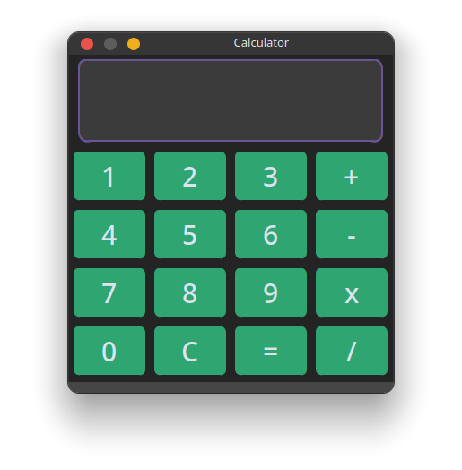
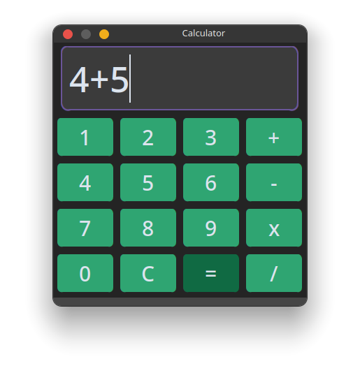
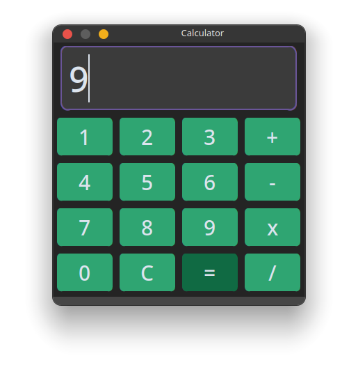

# CodeClause_Calculator

This is a GUI Based Calculator Application made using python, while focusing on lambda functions. 

### Requirements:
- Python 3.6 or above
- Tkinter Module (Built-in)
- CustomTkinter Module

### How to use:
- Clone the repository
- cd into the directory
- Install the requirements using `pip install -r requirements.txt`
- Run the `main.py` file
- Enjoy!

### Features:
- Basic Calculator Function 
  - Addition
  - Subtraction
  - Multiplication
  - Division
  

### Screenshots:
UI of the Calculator:

Functionality of the Calculator:

output of the Calculator:

